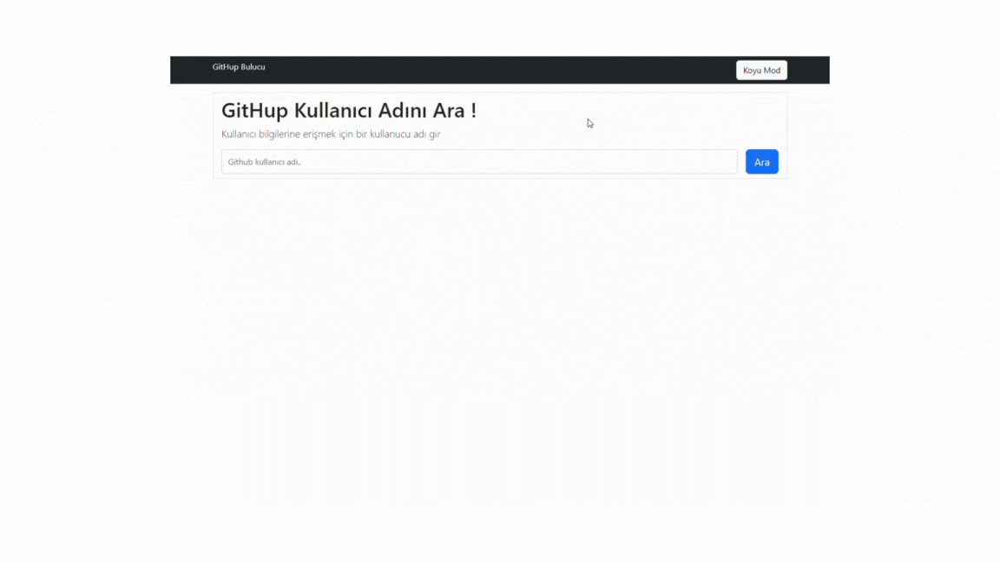

# GitHup-Finder

**GitHup-Finder**, GitHub kullanıcılarını aramak ve kullanıcı profillerini görüntülemek için kullanılan basit bir web uygulamasıdır. Bu uygulama, GitHub API'sini kullanarak kullanıcıların profillerini ve projelerini görüntülemenize olanak tanır.



## Özellikler

- GitHub kullanıcılarını arama.
- Kullanıcı profilini görüntüleme.
- Kullanıcının projelerini listeleyebilme.

## Nasıl Kullanılır

1. Tarayıcınızda `index.html` dosyasını açın.
2. GitHub kullanıcı adını arama kutusuna girin.
3. "Ara" düğmesine tıklayın veya Enter tuşuna basın.
4. Kullanıcı profili ve projeleri görüntüleyin.

## Canlı Demo

Uygulamanın canlı bir demosunu [buradan](https://githupfinder38.netlify.app/) görüntüleyebilirsiniz.

## Kurulum

Projeyi yerel makinenize klonlayın ve tarayıcınızda açın:

```bash
git clone <repo-url>
cd GitHup-Finder

